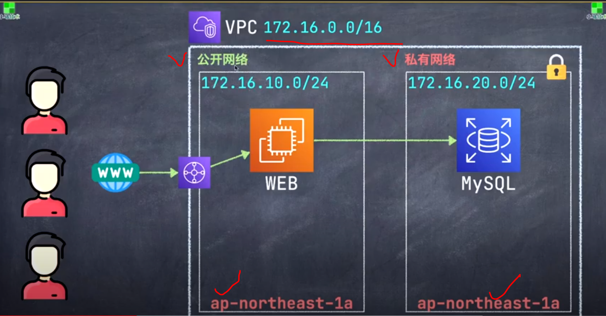

# AWS_Public_network & Privacy Network(公有網路 & 私有網路)
AWS_Website_Development

建立公私網 - 公私分明才能網路安全
==============================

## 知識點 : 

1.建立公有網路
2.建立私有網路

## [AMAZON VPC 官網](https://docs.aws.amazon.com/zh_tw/vpc/latest/userguide/VPC_Subnets.html "VPC 和子網路")

## 實戰演習 :

Visualize 公開網路與私有網路服務器於架構當中關係(VPC大樓 Tutorial 012 013 以建立完成)

