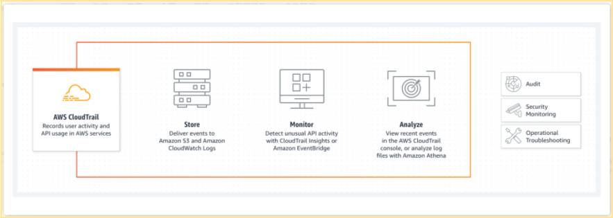

# AWS_Website 設置CloudTrail 監管用戶或API的活動行為 : 

AWS_Website_Development 07 08(p.06) 
===================================

## 知識點 :  紀錄系統中用戶或API的活動行為 (Who, When, What, ...) 各個活動項目都看得到
# 個人學習不一定需要CloudTrail 但如果是企業用戶最好使用!

 

### 注意點 : (送你一把槍, 但子彈要錢)
CloudTrail 本體免費(真實的謊言), 如果紀錄特殊的分析事件需要另行收費
CloudTrail 默認免費紀錄90天的操作日誌
 開啟系統跟蹤服務後, 日誌會寫入S3存儲桶, S3存儲桶另行收費
也就是另外買一個硬碟 自動幫您寫入資料, 但會收錢(若非企業不建議使用)

##實戰演習 : 
+ 1.選擇我們的所在區(Region)
+ 2.建立我們的系統跟蹤

