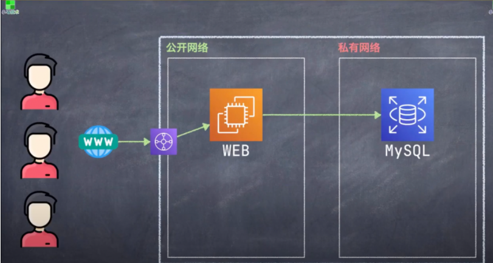

# AWS_Website 設置一個基本的web應用網路結構
+ 網路架構設計上手 - 越簡單越好
+ AWS_Website_Development 09 (p.07) 

## 知識點 : 設計部署一個超級簡單的網絡/web應用

+ 以下為一個基本的網路拓墣, 但該有都有 : 
    + 1.流程 ： 用戶 → www網址 →  web/ mysql/ 
    + 2.公開子網 ：web網址端(公開給所有用戶使用) 私有網路 ：mysql 數據庫（私人訊息）
    + 3.整個流程 ：用戶到數據庫找資料並回到用戶

## 實戰演習 : 
+ 1.網絡設計拓墣圖
+ 2.建立我們的系統跟蹤

