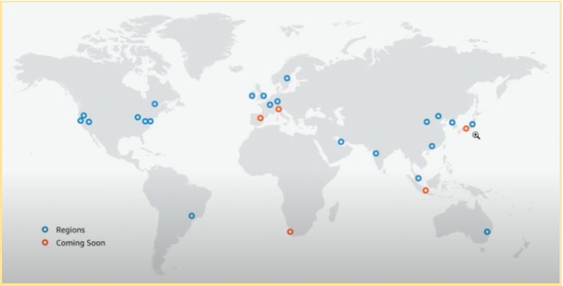

# AWS_Website 理解AWS區域和可用區
+ AWS_Website_Development 10（p.08） 

## 提出問題 :  做系統架構前必須考量的問題
+ 您在哪裡建立伺服器？ ex : 日本
+ 你應該建立多少伺服器？
+ 你應該怎樣建立伺服器？

## AWS 座落點世界地圖 :  
+ 藍色 ：已建立 idc（國家）
+ 橘色 ：建立中

## 知識點 :  
+ 理解區域（regions）
+ route53 ??
+ 理解可用區	az（avaliability zones）
+ 一個區分成多個可用區 可當作backup的概念
(!!)系統架構設計時就應該思考到部署多個伺服器概念 

