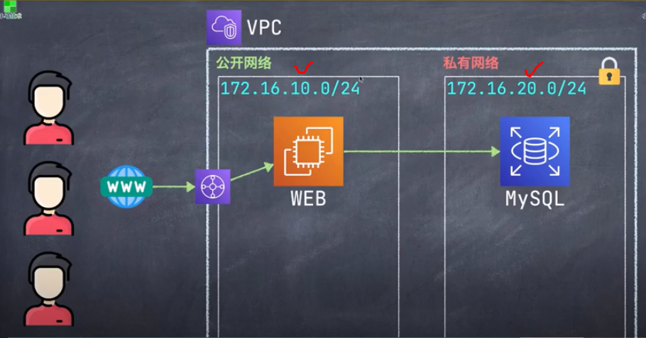

# AWS_Website 網絡IP範圍設計 - IP Network 
AWS_Website_Development

## 知識點 : 
+ 

## 實戰演習 : 

### 1.公開網路 : 
+ 主要用於對外公開的服務器, 如 : Web, API服務器
+ 網絡決定 
    + 172.16.10.0/24

### 2.私有網路 : 
+ 主要用于內部使用的服務器, 如: DB, Redis等
+ 網斷決定 
    + 172.16.20.0/24

### 示意圖 : 

### 擴展性考慮 : 
+ 考慮到系統整體可用性, 今後需要將系統服務到多個AZ區, 所以應該提前做好IP位置的規劃

