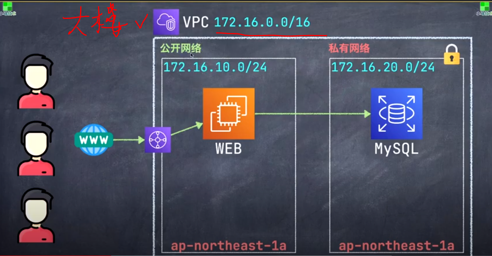

# Ch12/13 AWS_Public_network & Privacy Network建立VPC - 建立我們自己的IDC
AWS_Website_Development
==============================

## 知識點 : 

建立VPC(Virtual Private Cloud)
+ 可以把VPC理解為我們自己私有的IDC(互聯網數據中心)
+ 一棟數據中心大樓

### [AMAZON VPC 官網](https://aws.amazon.com/tw/vpc/ "VPC 和子網路")

## 實戰演習 :

### A.網段規則 : 
+ CIDR
    * 172.16.0.0/16
+ 標籤 : 
    * Name :  chp12/13_IDC-vpc

### 子網所屬VPC(回Tutorial 012 013 確認)

+ davidaws-vpc

### 公開網路 :

主要用於對外公開的服務器, 如 : Web, API服務器

+ 網段決定 :
    + 172.16.10.0/24
    + ap-northeast-1a
+ 標籤 :
    * Name : chp15-vpc_subnet_public_web-1a

### 私有網路 : 

主要用於內部使用的服務器, 如 : (個人)DB, Redis服務器

+ 網段決定 :
    + 172.16.10.0/24
    + ap-northeast-1a
+ 標籤 :
    * Name : chp15-vpc_subnet_privacy_db-1a

