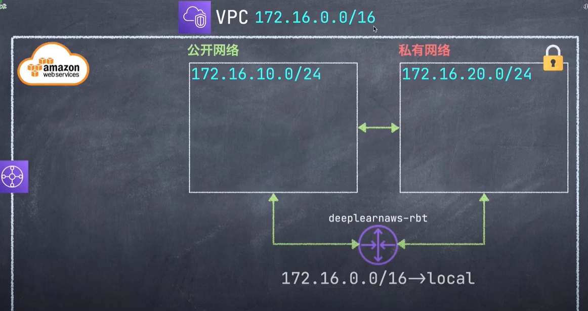

#  AWS Route Table(建立公網路由表 - 讓我們的子網連接到互聯網)
AWS_Website_Development
==============================

## 知識點 : 

1.理解路由表(Ch17)
2.建立路由表(Ch18)

## [AMAZON Route Table 官網](https://docs.aws.amazon.com/zh_tw/vpc/latest/userguide/WorkWithRouteTables.html "VPC 和子網路")

## 實戰演習 :

1.理解路由表 : 
目前為止的網絡結構

2.建立路由表 : 
+ RTB: ch18_RTB_web_rtb
    * VCP : davidaws-vcp(之前創建的)
    * Rule :ch18_Rule_igw
+ 把新路由綁訂到 davidaws-vpc-public-1a    
