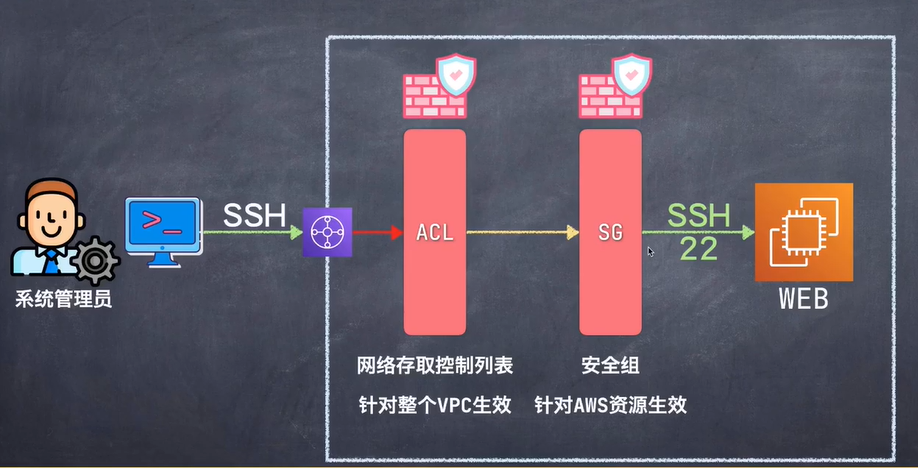

#  AWS 設置防火牆 : 網路ACL和安全組SG(security group)
AWS_Website_Development
==============================

## 知識點 : 

1.網路存取控制列表 - ACL(Ch19 20)
    - 整個VPC整體控制藉由ACL
    - 負責監聽所有數據流量
2.安全組 - Secutrity Group
    - 針對AWS資源(比如說Request/ ssh/ Lambda ...等)

解釋 : Amazon的防火牆系統, 通過以上兩個防火牆去過濾用戶傳回來的訊息, 若都合法才傳回服務器(Web, ex:chp12/13_IDC-vpc)中

## 實戰演習 :
+ 示意圖 :

 
###
1.Name : chp19_20_ACL_SG-web-sg

### 